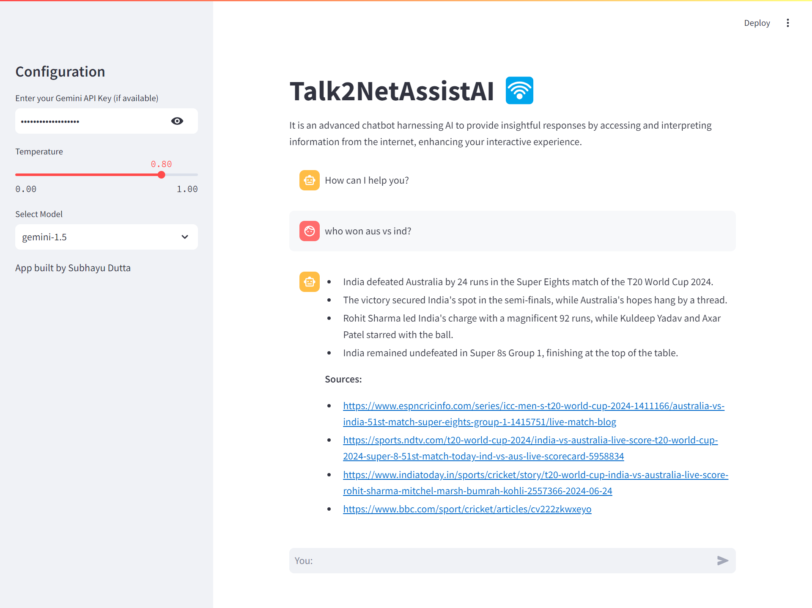

# Talk2NetAssistAI

Talk2NetAssistAI is an advanced chatbot powered by AI, designed to provide insightful responses by accessing and interpreting information from the internet, enhancing your interactive experience.

Visit the live app: [Talk2NetAssistAI](https://talk2csv.onrender.com/)

## Features

- Chat with an AI-powered assistant with internet access.
- Supports multiple GEMINI models: gemini-1.5, gemini-1.5-pro, gemini-1.0-pro, and gemini-1.5-flash.
- Adjustable temperature setting to control response randomness.
- Built using Streamlit for a user-friendly interface.

## Technologies Used:
- LangChain
- Streamlit
- Google Generative AI
- Faiss

## Installation:
1. Clone the repository: `https://github.com/subhayudutta/Talk2NetAssistAI.git`
2. Navigate to the project directory: `cd Talk2NetAssistAI`
3. Install dependencies: `pip install -r requirements.txt`

## Usage:
1. Run the Streamlit app: `streamlit run app.py`
2. Access the app in your browser at `http://localhost:8501`

## Usage:
1. Open the app in your browser.
2. Enter your Gemini API key if available.
3. Adjust the temperature setting using the sidebar slider.
4. Start chatting and get informative responses from the AI assistant.

## Example:
Enter a query in the chat box and receive an insightful response based on internet research and AI analysis.

## Configure the following settings in the sidebar:
1. Gemini API Key: Enter your Gemini API key for AI model access.
2. Temperature: Adjust the temperature slider for response generation.
3. Model Selection: Choose the appropriate AI model for data analysis.

## Contribution:
Contributions are welcome! Feel free to open an issue or submit a pull request.

## License:
This project is licensed under the [GPL-3.0 license](LICENSE).
Feel free to customize the README according to your project's specifics!

